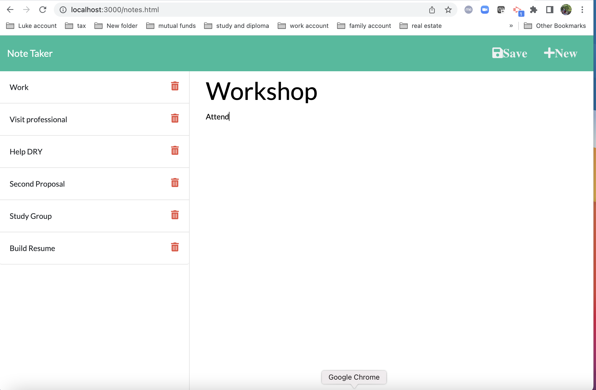
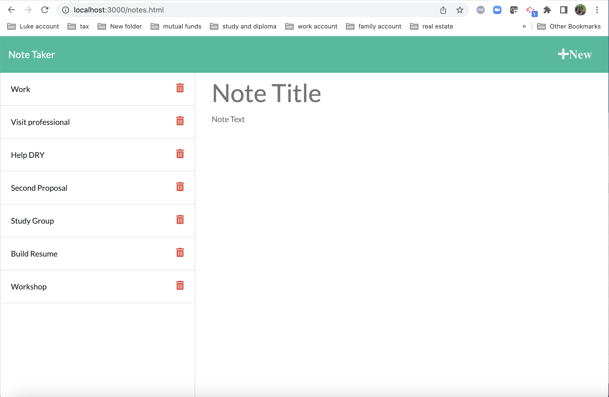
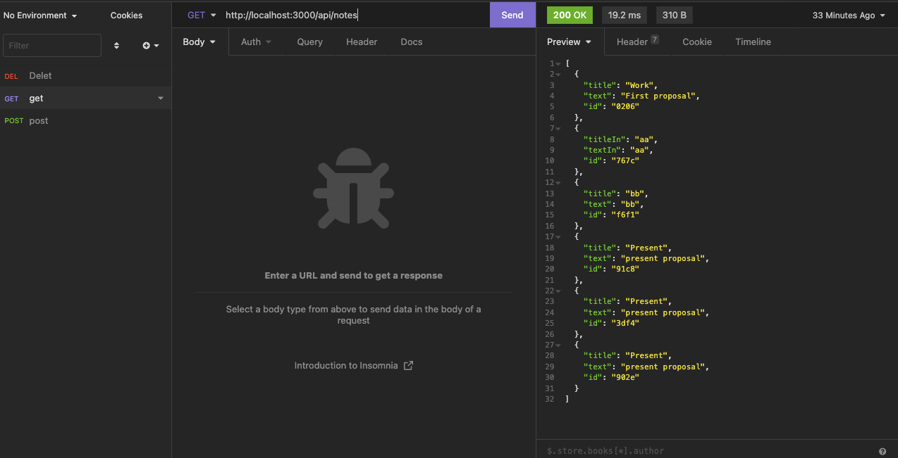
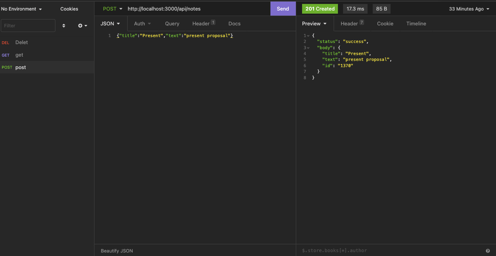
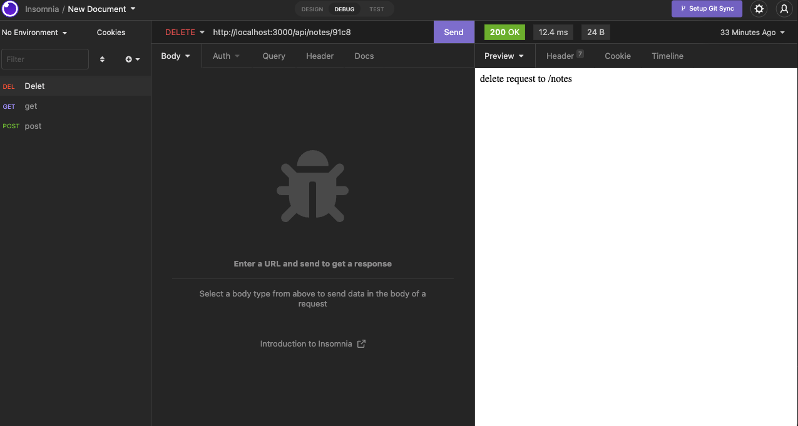

# noteTaker

- The URL of the functional, deployed application:

## Table of Contents

- [noteTaker](#notetaker)
  - [Table of Contents](#table-of-contents)
  - [Descripttion](#descripttion)
  - [Installation](#installation)
  - [Mock-Up](#mock-up)
  - [Questions](#questions)

---

## Descripttion

The small business owner WANTs to be able to write and save notes. SO THAT the small business owners can organize my thoughts and keep track of tasks the small business owners need to complete

Note-taking application

WHEN the small business owners open the Note Taker

THEN the small business owners am presented with a landing page with a link to a notes page

WHEN the small business owners click on the link to the notes page

THEN the small business owners am presented with a page with existing notes listed in the left-hand column, plus empty fields to enter a new note title and the note’s text in the right-hand column

WHEN the small business owners enter a new note title and the note’s text

THEN a Save icon appears in the navigation at the top of the page

WHEN the small business owners click on the Save icon

THEN the new note the small business owners have entered is saved and appears in the left-hand column with the other existing notes

WHEN the small business owners click on an existing note in the list in the left-hand column

THEN that note appears in the right-hand column

WHEN the small business owners click on the Write icon in the navigation at the top of the page

THEN the small business owners am presented with empty fields to enter a new note title and the note’s text in the right-hand column

---

## Installation

Use [express](https://www.npmjs.com/package/express)

---

## Mock-Up

The following images show the web application's appearance and functionality:

 

Using Insomnia to test server side.

---

## Questions

Feel free to reach out via Github or email with any questions.  
[Github](https://github.com/kayjinyi)  
[email](mailto:kayjinyi@gmail.com)

---
